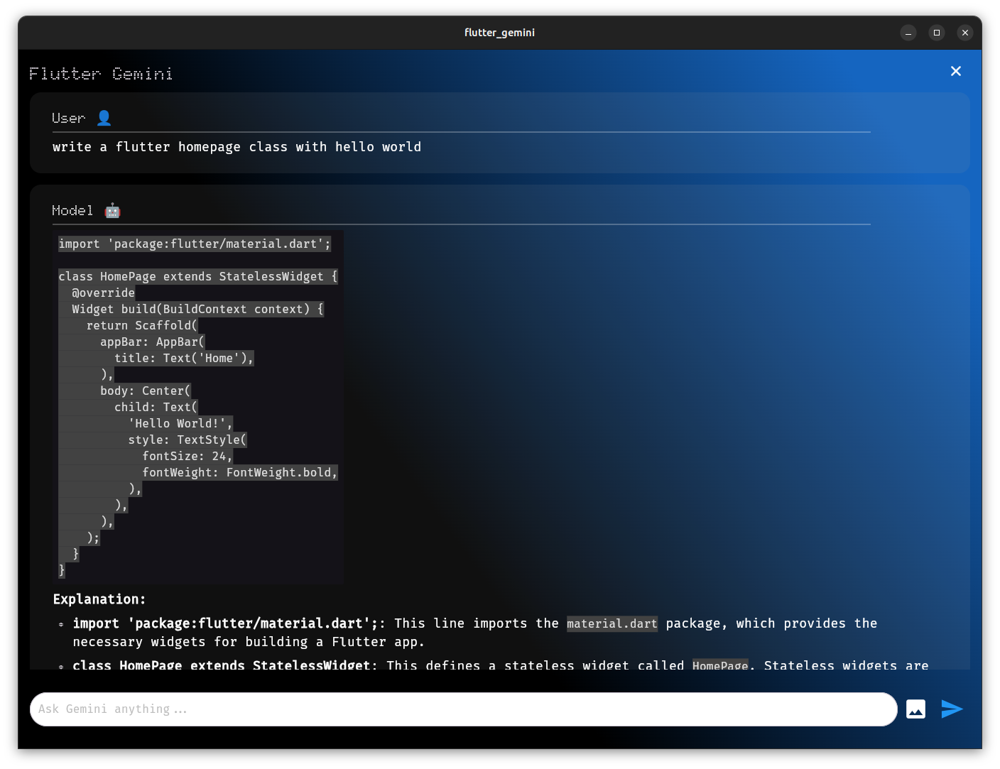

# flutter_gemini

A Flutter application that integrates with Gemini Api. The model that I am using is `gemini-1.5-flash`.

## Screenshot
### Linux


## Packages Used

- `bloc`
- `flutter_bloc`
- `dio`
- `cupertino_icons`
- `flutter_dotenv`
- `google_fonts`
- `lottie`
- `flutter_markdown`
- `image_picker`
- `flutter_image_compress`

### Installation:

1. Clone the repository:

```bash
git clone https://github.com/usman619/flutter_gemini.git
cd flutter_gemini
code .
```

2. Install the dependencies:

```bash
flutter pub get
```

3. Run using the following command:

```bash
flutter run
```